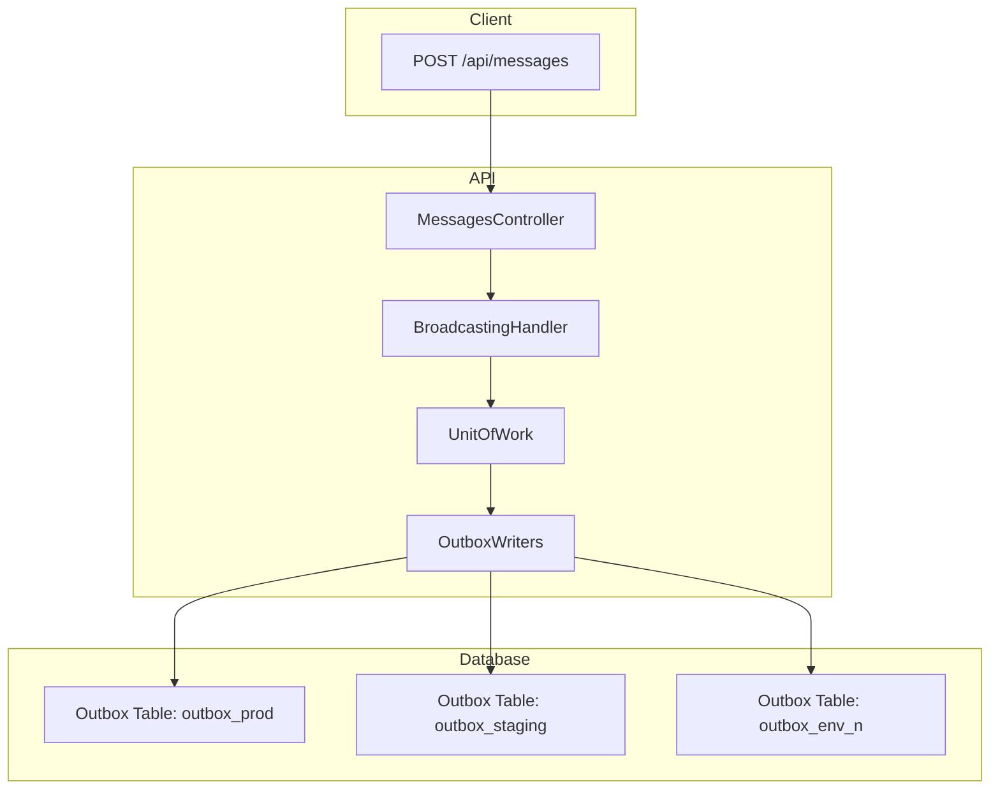
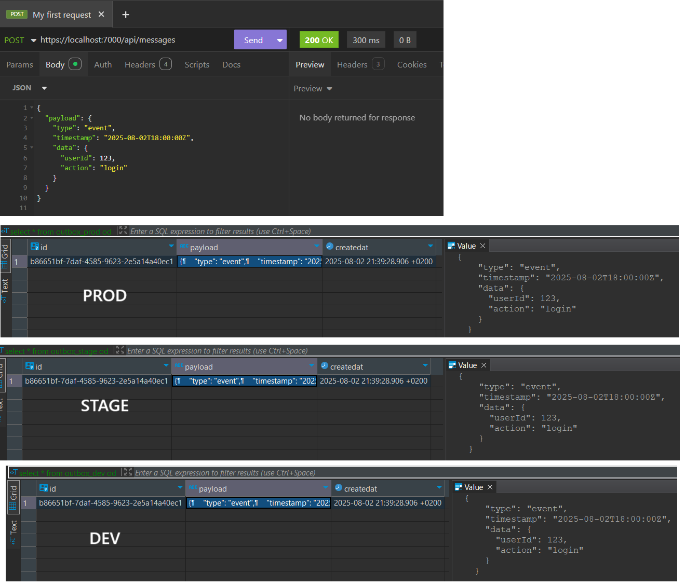

# HttpBroadcaster
Message broadcaster that receives HTTP POSTs and atomically dispatches messages to multiple outbox tables, each mapped to a different environment



## ℹ️ Outbox Table Processing

Each `outbox_{env}` table is intended to be processed by a **dedicated outbox consumer service**.  
These services are responsible for:

- Reading pending events from the corresponding outbox table
- Dispatching them to their target environment (e.g., Kafka, HTTP API, WebSocket)
- Handling delivery retries, error tracking, and cleanup

> **Note:** This repository focuses only on the ingestion and atomic writing of messages to outbox tables.  
> It does not include the implementation of outbox consumers.

For a practical example of an outbox consumer, see:  
👉 [**ntulenev/SimpleTransactionalOutbox**](https://github.com/ntulenev/SimpleTransactionalOutbox)

## 🛠 Setup Instructions

To run this project, you need to configure the list of environments and ensure that corresponding outbox tables exist in your PostgreSQL database.

### 1. Configure `appsettings.json`

Specify the environments that the broadcaster should write to:

```json
{
  "UnitOfWorkConfiguration": {
    "OutboxEnvironments": [ "DEV", "STAGE", "PROD" ]
  }
}
```

Each environment will correspond to a physical table named outbox_{ENV}.

### 2. Create Outbox Tables

For each environment, you must manually create an outbox table in your database.

Example for `PROD`:

```sql
CREATE TABLE IF NOT EXISTS outbox_PROD (
    Id UUID PRIMARY KEY,
    Payload TEXT NOT NULL,
    CreatedAt TIMESTAMPTZ NOT NULL
);
```

You can find the initial migration script in:
```
HttpBroadcaster/src/Migration/001_Create_Outbox_Tables.sql
```

## 🚀 Example of usage

