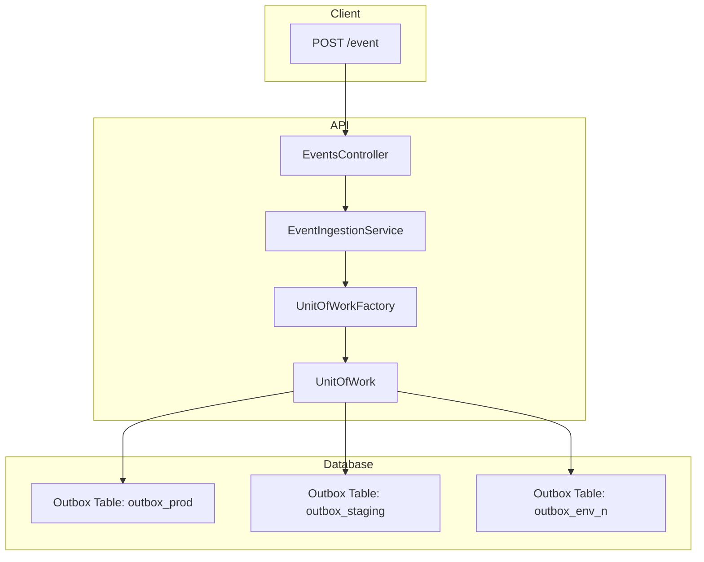

# HttpBroadcaster
Message broadcaster that receives HTTP POSTs and atomically dispatches messages to multiple outbox tables, each mapped to a different environment

## ℹ️ Outbox Table Processing

Each `outbox_{env}` table is intended to be processed by a **dedicated outbox consumer service**.  
These services are responsible for:

- Reading pending events from the corresponding outbox table
- Dispatching them to their target environment (e.g., Kafka, HTTP API, WebSocket)
- Handling delivery retries, error tracking, and cleanup

> **Note:** This repository focuses only on the ingestion and atomic writing of messages to outbox tables.  
> It does not include the implementation of outbox consumers.

For a practical example of an outbox consumer, see:  
👉 [**ntulenev/SimpleTransactionalOutbox**](https://github.com/ntulenev/SimpleTransactionalOutbox)

